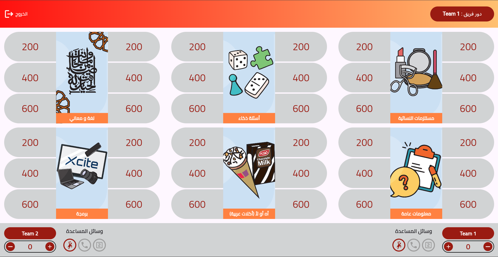

# S5S5 - سين جيم Demo

A Flutter web demo version of the popular Arabic trivia game **سين جيم (Seen Jeem)**, featuring 2-team competitive gameplay with strategic helper tools.

## 🎮 Live Demo

**[Play Now](https://hazemattia7.github.io/s5s5/)**

> **Note:** Currently optimized for Chrome desktop. Mobile responsive design coming soon.

## 📸 Screenshots

<div align="center">
  
  
  
  
  
  
</div>

## 🎯 About

This is an internal demo showcasing the core gameplay mechanics of سين جيم (Seen Jeem), a group trivia game where two teams compete by answering questions across various categories. The game combines knowledge testing with strategic helper tools to create an engaging competitive experience.

## ✨ Features

### Game Content
- **2,600+ Questions** across 26 diverse categories
- **Two-Team Competition** with automatic turn management
- **Manual Scoring System** - award points to the team that answers correctly
- **Strategic Gameplay** with 3 powerful helper tools

### Helper Tools

Each team has access to 3 special tools that can change the game:

1. **🕳️ الحفرة (The Hole)**
   - Risk/reward tool used before seeing the question
   - If answered correctly: Add points to your team AND subtract the same points from opponents
   - Double impact on the score!

2. **📞 اتصال بصديق (Call a Friend)**
   - Get help from someone knowledgeable
   - Use strategically on difficult questions

3. **✌️ جاوب جوابين (Two Answers)**
   - Not sure between two options?
   - Submit both answers to secure the points

### Working Features
- Fully functional game logic
- Automatic turn rotation between teams
- Real-time score tracking
- Question bank system with JSON data structure
- Category selection
- Helper tool activation and tracking

## 🛠️ Tech Stack

- **Framework:** Flutter Web
- **Deployment:** GitHub Pages
- **Data Storage:** JSON files in assets folder
- **Tested On:** Chrome (Desktop)

## 🚀 How to Play

1. Visit the [live demo](https://hazemattia7.github.io/s5s5/)
2. Form two teams
3. Teams automatically take turns answering questions
4. Manually award points to the team that answers correctly
5. Use helper tools strategically to gain advantage
6. The team with the most points wins!


## 📝 Question Bank Format

Questions are stored in `assets/questions.json` with the following structure:

```json
{
  "categories": [
    {
      "name": "Category Name",
      "image": "category image url",
      "questions": [
        {
          "id" : 1
          "question": "Question text",
          "answer": "Answer Text",
          "image": null,
          "points": 200
        }
      ]
    }
  ]
}
```

## 🔮 Future Improvements

- **Responsive Design:** Add mobile and tablet support for iOS and Android
- **Expanded Content:** Continuously add new questions and categories to the question bank
- **Enhanced Categories:** Include all categories from the original game

## 🌐 Browser Support

- ✅ Chrome (Desktop) - Fully tested
- ⚠️ Other browsers - May work but not officially tested
- ❌ Mobile browsers - Not responsive yet

## ⚙️ Development

This is a Flutter Web project. To modify or extend:

1. Ensure you have Flutter SDK installed
2. Clone this repository
3. Run `flutter pub get` to install dependencies
4. Run `flutter run -d chrome` for local development
5. Build with `flutter build web` for production

To add new questions or categories, edit the `assets/data/questions.json` file following the existing structure.

## 📌 Demo Limitations

This demo version differs from the full game:
- **Included:** 26 categories with 2,600+ questions
- **Included:** 3 helper tools (Hole, Call a Friend, Two Answers)
- **Missing:** Some categories from the original game
- **Missing:** Responsive design for mobile devices
- **Missing:** Additional helper tools from full version

## 📖 About سين جيم (Seen Jeem)

سين جيم
</br>means "question and answer" in Arabic. The full game is a popular Arabic trivia game designed for social gatherings, family events, and cultural occasions. This demo showcases the core mechanics and gameplay experience.

---

**Internal Demo Version** - Built with Flutter Web | [View Live Demo](https://hazemattia7.github.io/s5s5/) 
